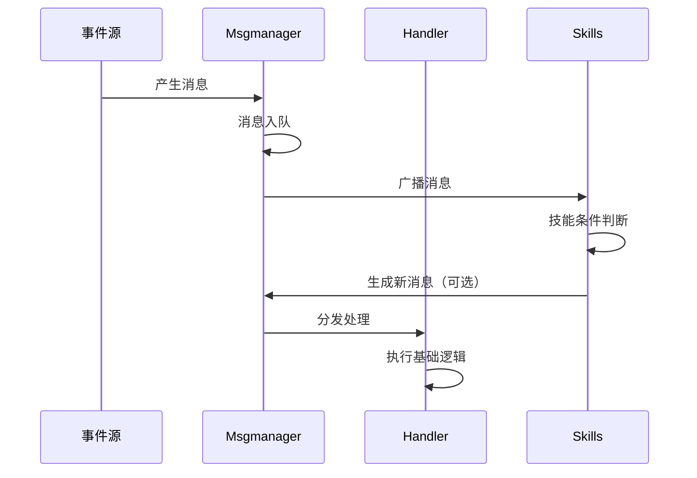

# Simple Passive Skill Framework with Python 🎮✨

基于事件驱动和观察者模式的轻量级被动技能实现框架

[](https://www.python.org/downloads/)

##需要处理更复杂、更自定义的情况？
EvFrame用于高策略性RPG游戏的复杂事件处理,可以适应于需要高度自定义和动态修改事件处理逻辑的或者多层嵌套和连锁的复杂系统，
如果你需要这种高复杂度的事件，请移步
👉[EvFrame框架](https://github.com/687jsassd/ComplexEvent_RPGframe--Python-)
## 目录
- [核心特性](#核心特性)
- [快速开始](#快速开始)
- [架构设计](#架构设计)
- [技能开发指南](#技能开发指南)
- [示例代码](#示例代码)
- [性能规范](#性能规范)
- [贡献指南](#贡献指南)

---

## 核心特性

🔥 **事件驱动架构**  
- 基于`GameMessage`的消息传递系统
- 支持动态注册/注销事件类型
- 内置伤害、治疗、跳过等基础事件类型

🛡️ **被动技能系统**  
- 可选冷却时间机制（CD）
- 技能触发条件灵活配置
- 支持技能效果链式反应

⚡ **高效消息处理**  
- 优先消息队列管理
- 自动死循环检测
- 超时中止保护机制

🔧 **可扩展设计**  
- 模块化技能组件
- 继承式处理器设计
- 类型安全的消息验证

---

## 快速开始

### 环境要求
- Python 3.10+（必需模式匹配语法）

### 基础使用
```python
# 初始化角色和技能
hero = Char(name="英雄", team=1, hp=100)
enemy = Char(name="怪物", team=2, hp=200)

# 创建技能实例
fireball = Fireball(owner=hero)
skip = Skip(owner=enemy)

# 初始化消息管理器
msgm = Msgmanager()
msgm.register(fireball)
msgm.register(skip)

# 构建并发送消息
attack_msg = GameMessage(
    exc=enemy,
    acp=hero,
    typ=DAMAGE,
    val=15,
    spe={},
    mng=msgm
)

# 执行消息处理
msgm.acceptmsg(attack_msg)
msgm.exect()
```

## 架构设计

### 核心组件

| 组件          | 职责描述               |
| :------------ | :--------------------- |
| `GameMessage` | 标准化消息数据结构     |
| `Handler`     | 事件类型注册与处理中心 |
| `Msgmanager`  | 消息队列管理与执行引擎 |
| `Char`        | 游戏角色实体           |
| `Skill`       | 技能基类（需继承实现） |

### 消息处理流程



------

## 技能开发指南

### 继承Skill基类

```python
class YourSkill(Skill):
    def __init__(self, owner=None):
        super().__init__(name="技能名称", owner=owner, reg_type="自定义事件类型")
        self.cd = 0
    
    def update(self, msg: GameMessage):
        # 触发条件判断逻辑
        pass
    
    def type_effect(self, msg: GameMessage):
        # 具体技能效果实现
        pass
```

### 开发规范

1. **冷却管理**：通过`self.cd`实现CD机制
2. **条件判断**：在`update()`中使用模式匹配
3. **效果隔离**：在`type_effect()`中实现具体逻辑
4. **消息生成**：通过`acceptmsgp()`插入优先消息

------

## 示例代码

### 测试案例输出

```text
[Fireball]测试主角的Fireball技能发动！
执行者测试主角回复9hp！ 剩余hp:94
目标一个小怪扣除10hp！ 剩余hp:240
[Fireball]技能发动完毕！
...
统计:主角受伤6,小怪受伤10
```

### 完整测试案例

见 [test.py](test.py)

------

## 性能规范

### 处理限制

| 指标           | 阈值  | 说明               |
| :------------- | :---- | :----------------- |
| 最大消息链长度 | 100   | 单次处理最多消息数 |
| 循环检测阈值   | 20    | 疑似死循环中止条件 |
| 单消息超时     | 400ms | 超时保护机制       |

### 最佳实践

- 保持技能逻辑原子化
- 避免在消息处理中阻塞
- 优先使用基础事件类型
- 及时清理未使用的监听器

------

## 贡献指南

欢迎通过 Issue 或 Pull Request 参与贡献！

1. Fork 本仓库
2. 创建特性分支 (`git checkout -b feat/新特性`)
3. 提交修改 (`git commit -am '添加新特性'`)
4. 推送到分支 (`git push origin feat/新特性`)
5. 创建 Pull Request

**开发规范**：

- 遵循 PEP8 编码规范
- 新事件类型需添加单元测试
- 保持向下兼容性
